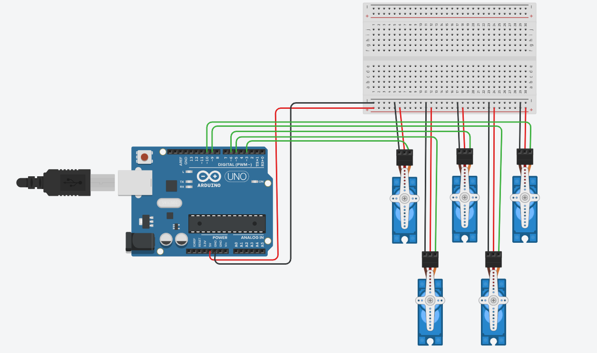

# [Program 5 servo motors](https://www.tinkercad.com/things/3kiFvj68EYG-5servomotor)
Program 5 servo motors to perform the following actions in the code :	

Run using the Sweep example for 2 seconds, After that, make all the motors hold at 90 degrees

for that we need
| Name  | Quantity | Component |
|-------|-----------|------------|
| U1 | 1 | Arduino Uno R3 |
|SERVO1,2,3,4,5| 5 | 	Positional Micro Servo |

By connected five servo motors to an Arduino UNO board using a breadboard.

Each servo motor is connected as follows:
  1. The signal wire is connected to Arduino pins 3, 4, 5, 6, and 7.
  2. The power wire (VCC) is connected to the 5V rail on the breadboard.
  3. The ground wire (GND) is connected to the ground rail on the breadboard.

All servos share the same power and ground lines and receive control signals from the Arduino.
The program makes all servos sweep back and forth for 2 seconds and then hold at 90°.

### Code Explanation
```
#include <Servo.h>
```
Includes the Servo library, which allows easy control of servo motors.
```
Servo servos[5];              
const int servoPins[5] = {3, 4, 5, 6, 7};  
int pos = 0;
unsigned long startTime;
```
 Creates an array of five servo objects.
 Defines an array servoPins for the pins connected to each servo.
 The variable pos stores the current angle of the servos.
 The variable startTime records when the program starts.
 
```
 void setup() {
  for (int i = 0; i < 5; i++) {
    servos[i].attach(servoPins[i], 500, 2500);
  }
  startTime = millis();
}
```
🔹 In the `setup()` function, each servo is attached to its corresponding pin using a for loop.
🔹 `attach()` links each servo to its pin and defines pulse width limits from 500 µs to 2500 µs.
🔹 `millis()` records the current time to track the 2-second sweep duration.

```
if (millis() - startTime <= 2000) {
```
Checks whether 2 seconds have passed since the program started.
If true, the servos perform the sweep motion.
```
for (pos = 0; pos <= 180; pos++) {
  for (int i = 0; i < 5; i++) {
    servos[i].write(pos);
  }
  delay(15);
}
```
 Moves all servos gradually from 0° to 180°.
 The delay(15) ensures smooth movement and gives time for the servos to reach each position.
```
 for (pos = 180; pos >= 0; pos--) {
  for (int i = 0; i < 5; i++) {
    servos[i].write(pos);
  }
  delay(15);
}
```
 After reaching 180°, the servos gradually move back to 0°.
 
```
 } else {
  for (int i = 0; i < 5; i++) {
    servos[i].write(90);
  }
  while (true);
}
```
 Once 2 seconds have passed, all servos are set to 90° (center position).
 The line while (true); stops the program permanently so the motion does not restart.

 

